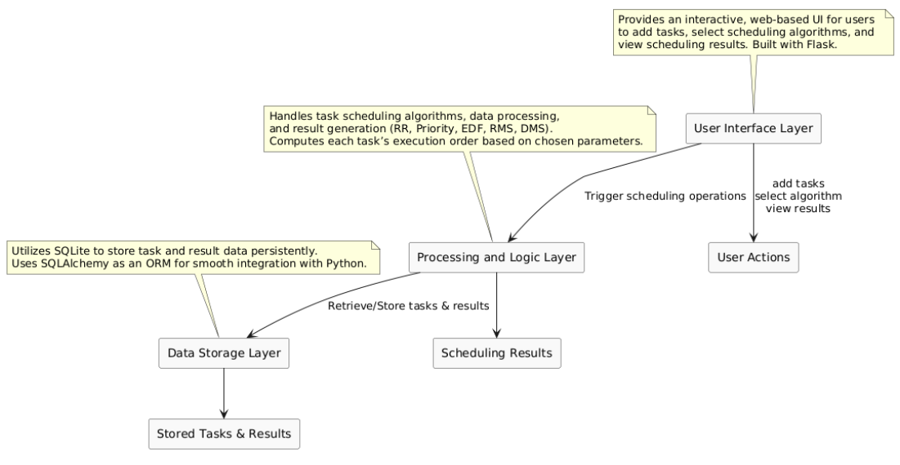

---

## System Design




---

## Extended Project Explanation

### 1. Introduction

#### Project Introduction
The **Real-Time CPU Scheduling Simulator** simulates and analyzes the performance of multiple CPU scheduling algorithms in a user-friendly environment. Real-time systems often require tasks to be completed within strict time constraints. By implementing **RR, Priority Scheduling, EDF, RMS, and DMS**, this simulator helps users:

- Understand how each scheduling approach manages tasks.
- Observe algorithm-specific strengths, weaknesses, and trade-offs.
- Gain practical insights into real-time CPU scheduling and resource management.

#### Background and Importance
Real-time systems are used in domains such as **medical devices, automotive control, and industrial automation**. Meeting deadlines is vital in these systems. Common scheduling algorithms include:

- **Round Robin (RR)**: Fair time-sharing.
- **Priority Scheduling**: Executes tasks based on priority.
- **Earliest Deadline First (EDF)**: Prioritizes tasks nearest to deadlines.
- **Rate Monotonic Scheduling (RMS)**: Prioritizes tasks with shorter periods.
- **Deadline Monotonic Scheduling (DMS)**: Prioritizes tasks with shorter deadlines.

#### Objectives
1. Provide an **interactive web-based** platform for creating and managing tasks.
2. Implement **five key scheduling algorithms** (RR, Priority, EDF, RMS, DMS).
3. Generate **visual Gantt charts** for CPU allocation insights.
4. Evaluate each algorithm’s **strengths and constraints** in real-time.


---


### 2. Literature Review

Key references:

1. **Kumar, Vimal** – *RealTime Systems and CPU Scheduling*  
2. **ResearchGate** – *A Study on Task Scheduling Algorithms in RealTime Systems*  
3. **Embedded Systems Association** – *Task Scheduler in RTOS*  
4. **Hassan, M.** – *A New RealTime Simulator for Task Scheduling*  
5. **Anju Pillai, T.B. Isha** – *A new real time simulator for task scheduling*  
6. **Jagbeer Singh** – *Study on Task Scheduling Algorithms*

---


### 3. Design and Implementation

#### 3.1 Task Representation and Database
- Each **task** has:  
  - Execution Time  
  - Priority  
  - Deadline (and/or period)  
- Tasks are stored in a **SQLite database**, managed via SQLAlchemy.  
- **Tables**:
  - **Tasks Table**: Stores ID, execution time, priority, deadline.  
  - **Results Table**: Stores start/end times, missed deadlines, etc.

#### 3.2 Scheduling Algorithms

1. **Round-Robin (RR)**  
   - Assigns a time slice (quantum) to each task in a cyclic manner.  
   - Suitable for **fairness** and user-interactive systems.  

2. **Priority Scheduling**  
   - Sorts tasks by priority; high-priority tasks can preempt lower-priority tasks.  
   - Effective for urgent tasks but can starve low-priority ones.

3. **Earliest Deadline First (EDF)**  
   - Dynamically picks tasks with the **closest deadline** first.  
   - Great for meeting deadlines if the system load is reasonable.

4. **Rate Monotonic Scheduling (RMS)**  
   - Static priority based on **shorter periods** = higher priority.  
   - Ideal for strictly periodic tasks (deadlines = periods).

5. **Deadline Monotonic Scheduling (DMS)**  
   - Static priority based on **shorter deadlines** = higher priority.  
   - Good for tasks with varied deadlines, still a static assignment.

#### 3.3 Gantt Chart Visualization
Uses **Plotly** (or a similar library) to visually display each task’s start/end times, making it easier to see overlaps, scheduling order, and missed deadlines.

---

### 4. System Requirements

#### 4.1 Software
- **Python 3**  
- **Flask** (web framework)  
- **SQLAlchemy + SQLite** (database)  
- **Plotly** (visualization library)

#### 4.2 Functional Requirements
1. **Task Management**: Add/view/delete tasks.  
2. **Algorithm Selection**: RR, Priority, EDF, RMS, DMS.  
3. **Result Visualization**: Gantt chart for CPU timeline.  
4. **Persistent Storage**: Data remains in SQLite for analysis.

#### 4.3 Non-Functional Requirements
- **Usability**: Simple UI for non-experts.  
- **Performance**: Minimal delays even with multiple tasks.  
- **Reliability**: Accurate scheduling logic.  
- **Scalability**: Extendable to more algorithms or advanced real-time features.

---

### 5. RTS Algorithms in Detail

1. **Round-Robin (RR)**  
   - Cyclic, fair time-sharing.  
   - Not deadline- or priority-aware.

2. **Priority Scheduling**  
   - Executes high-priority tasks first.  
   - Risk of starvation for low-priority tasks.

3. **Earliest Deadline First (EDF)**  
   - Dynamically reorders tasks by nearest deadline.  
   - Optimal if the system is not overloaded.

4. **Rate Monotonic Scheduling (RMS)**  
   - Priority ∝ 1/Period.  
   - Best for periodic tasks with deadlines = periods.

5. **Deadline Monotonic Scheduling (DMS)**  
   - Priority ∝ 1/Deadline.  
   - More flexible than RMS for varied deadlines but still static.

---

### 6. Comparison & Performance

#### 6.1 Efficiency
- **RR**: Fairness, potential overhead from frequent context switches.  
- **Priority**: Immediate service for urgent tasks, possible starvation.  
- **EDF**: Deadline-focused, can miss deadlines if load > 100%.  
- **RMS**: Predictable for periodic tasks under utilization limits.  
- **DMS**: Better for diverse deadlines, still static.

#### 6.2 Suitability
- **RR**: Interactive/time-sharing.  
- **Priority**: Systems with distinct urgent tasks.  
- **EDF**: Hard real-time where deadlines are critical.  
- **RMS**: Safety-critical periodic tasks.  
- **DMS**: Mixed deadlines but consistent design.

#### 6.3 Limitations
- **RR**: Ignores deadline/priority.  
- **Priority**: Starvation of low-priority tasks under heavy load.  
- **EDF**: Overload causes missed deadlines.  
- **RMS**: Requires deadlines = periods; fully static.  
- **DMS**: Also static; complex if deadlines frequently change.

---

### 7. Testing and Evaluation

#### 7.1 Testing Strategies
- **Unit Tests**: Check each scheduling function (sorting, quantum allocation, etc.).  
- **System Tests**: Run the full app, add tasks, verify Gantt chart output, confirm DB persistence.

#### 7.2 Results
- **RR**: Correct cycling, fairness.  
- **Priority**: High-priority tasks finish first, possible low-priority starvation.  
- **EDF**: Good deadline adherence unless overloaded.  
- **RMS**: Works under utilization bounds for periodic tasks.  
- **DMS**: Manages different deadlines better than RMS but still static priorities.

---

### 8. Results and Analysis

- **Gantt Charts** show start/end times accurately.  
- Observed behaviors:
  - **RR**: Even CPU slices.  
  - **Priority**: Higher priority tasks dominate CPU.  
  - **EDF**: Schedules tasks just-in-time for upcoming deadlines.  
  - **RMS**: Shorter period tasks dominate schedule.  
  - **DMS**: Tasks with tighter deadlines run first.

---

### 9. Conclusion 

#### 9.1 Conclusion
This project provides an **interactive platform** to explore, understand, and compare real-time scheduling algorithms. By testing tasks of different priorities, deadlines, or periods, users can see how each approach distributes CPU time and handles urgent tasks or deadline requirements.


---

## Installation and Usage

1. **Clone the Repository**:
   ```bash
   git clone https://github.com/your-username/real-time-task-scheduler.git
   cd real-time-task-scheduler
